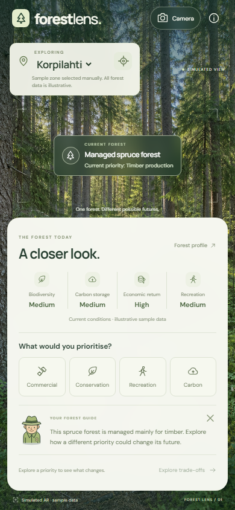
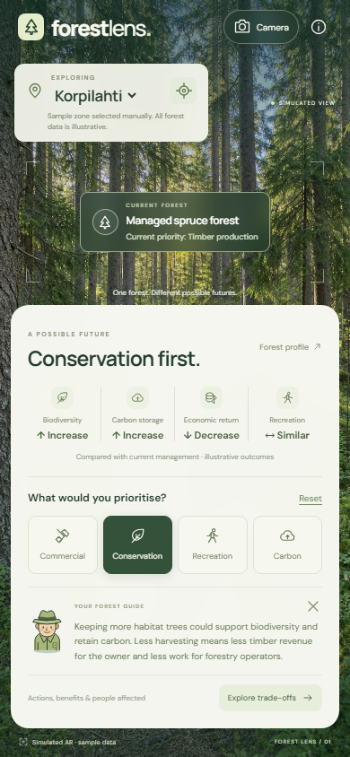
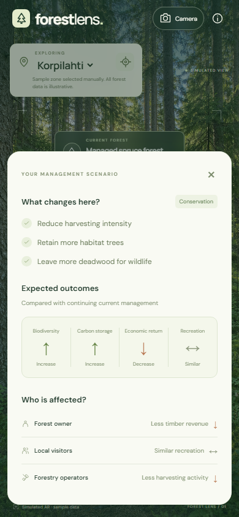

# Forest Lens

**Explore how different management priorities could change a forest and the people who use it.**

Forest Lens is a mobile-first web prototype for forest management decision support. It presents a forest's current profile, lets the user explore four management priorities, and explains their possible benefits, trade-offs and effects on stakeholders through a simulated augmented reality (AR) interface.

This first version focuses on making those choices understandable. All forest profiles and outcomes are hardcoded sample data, not measurements, forecasts or management recommendations.

## The objective

The question behind the app is: **“If we change the priority for this forest, what changes here, and who is affected?”**

We want to explore whether a visual, place-based interface can help users connect an abstract priority, such as conservation, with concrete actions and consequences. Forest owners, planners, students and community participants are possible audiences; the prototype has not yet been validated with them.

The app does not choose a winning scenario. It supports discussion about different priorities and their trade-offs.

## How the experience works

### 1. Understand the forest, then explore a priority

The user starts with a sample forest zone and four indicators: **biodiversity, carbon storage, economic return and recreation**. The forest label describes its current management priority. **Forest profile** opens the baseline details.

Selecting **Commercial, Conservation, Recreation or Carbon** updates the indicators and the guide's explanation. Arrows describe changes **compared with continuing current management**, rather than absolute scores or a ranking of the scenarios. For example, continuing commercial management in an existing timber forest leaves the sample outcomes unchanged.

| Current forest | Conservation selected |
| :---: | :---: |
|  |  |

The 2D forest guide gives a short interpretation of the selected scenario. Its text is predefined, not generated by a chatbot. Users can dismiss or reopen it. **Reset** returns to the current profile; selecting another zone also resets the scenario.

### 2. Connect the outcomes to actions and people

**Explore trade-offs** opens three complementary explanations:

- **What changes here?** Concrete management actions, such as reducing harvesting intensity or retaining habitat trees.
- **Expected outcomes.** The four indicators relative to the current management baseline.
- **Who is affected?** Implications for the forest owner, local visitors and forestry operators.

In the conservation example, the sample assumptions connect reduced harvesting with less timber revenue and less harvesting activity. Recreation stays similar because this preset does not include improvements to visitor facilities.

<p align="center">
  
</p>

*These are screenshots of the working prototype, using illustrative data.*

## Why this approach could be useful

The design is based on several hypotheses to test:

- **Visual context could make the decision less abstract.** Keeping the forest visible may help users relate management choices to a place.
- **A shared baseline could make comparisons clearer.** Every scenario uses the same four indicators and current management reference.
- **Actions and stakeholders could explain the trade-offs better than scores alone.** Users can see both what management would involve and who could benefit or face costs.
- **Short, scripted guidance could reduce the explanation burden.** The guide provides consistent context without requiring a conversation or additional input.

These are design intentions, not established results. A useful evaluation would check whether users can explain a trade-off, identify an affected stakeholder, and distinguish the sample outcomes from real evidence. Comparing the forest view with a plain information interface would also help test whether the visual context adds value.

## What is implemented, and what is simulated

| Part | Current prototype |
| --- | --- |
| Forest zones | Three hardcoded Finnish sample zones, with 12 zone/scenario combinations. |
| Forest information | Mock profiles and directional outcome assumptions. No external forest datasets or prediction model. |
| AR experience | A generated forest photograph, a viewfinder and overlaid zone information. No tree recognition, object tracking or mapped boundaries. |
| Camera button | UI demonstration only. It does not open a camera or request camera permission. |
| Forest guide | A local SVG character with predefined text for each zone and scenario. No AI chat. |
| Location | Manual zone selection and optional GPS matching within sample radii. Outside those zones, manual exploration remains available. |
| Financial and carbon values | Qualitative indicators only. No carbon pricing, carbon credits or calculated financial returns. |

Hardcoded data keeps this first prototype focused on the interaction and explanation. The photograph is a generic simulated view, not an image of the selected zone. Changing priorities changes the information, not the trees in the photograph.

GPS is requested only when the user taps the location button. Coordinates stay in the browser and are not saved or uploaded. GPS needs HTTPS or localhost; the rest of the experience works without it.

## Run locally

Requires **Node.js 20 or newer**. No dependency installation is needed.

```sh
node server.mjs
```

Open [localhost:5173](http://localhost:5173). On Windows, `npm.cmd start` also works.

The app uses HTML, CSS and browser JavaScript, served by a dependency-free Node.js development server.

## Project files and checks

- [`data.js`](data.js): profiles, sample coordinates, scenario assumptions and guide scripts.
- [`app.js`](app.js): interaction logic and optional GPS matching.
- [`index.html`](index.html) and [`styles.css`](styles.css): interface and responsive layout.
- [Forest background](assets/forest-camera.png) and its [generation prompt](assets/forest-camera.prompt.txt).
- [Documentation screenshots](docs/screenshots/): the three images used in this README.

Run the data checks with:

```sh
node --test
```

With the app running, `node scripts/check-browser.mjs` checks browser interactions and responsive layouts using installed Microsoft Edge. Set `BROWSER_PATH` for another Chromium executable. Checks include scenarios, the guide, details, GPS states, access to controls on small screens, and confirmation that no camera hardware is requested. Test screenshots are written to the ignored `artifacts/` directory.

The background was created with the built-in image generation tool; the guide and icons are local SVG graphics. Google Fonts is optional, with system font fallbacks.
